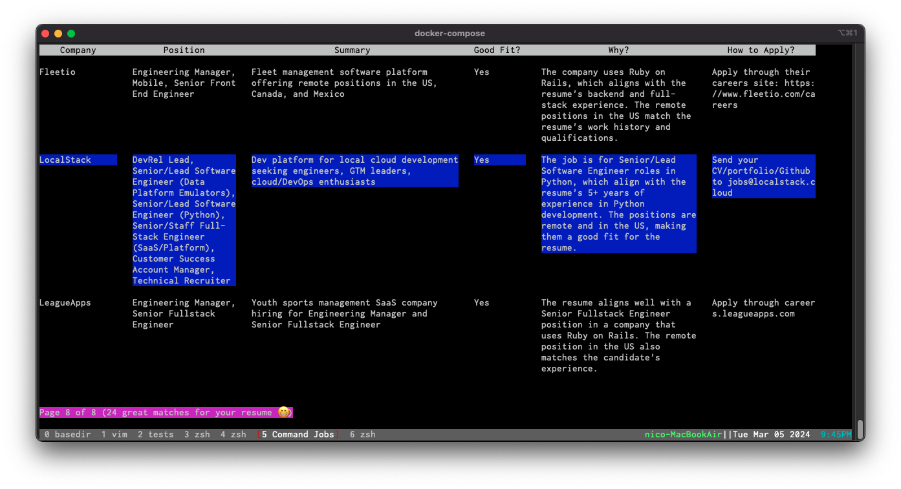

# Command Jobs &nbsp;&nbsp; [](https://github.com/nicobrenner/commandjobs)


Use AI to find the best jobs for your resume and preferences. A distraction-free, local-first, command line interface to scrape online jobs, and filter them to your needs

[](https://www.loom.com/share/403ea058ab91401fbb6ccee7faa22bb7)


Using AI, Command Jobs makes sure to find only the absolute best matches for your experience, skills and job preferences

Stop wasting your time with online tools that are not built for you, the job finder

Command Jobs is the only job searching tool that runs from where you work, the terminal. And yes, it also doesn't make you read through hundreds of job listings just to find a couple of good matches

This is just starting out! Follow along as we improve it

To get started, check out [Quick Start](#quick-start), [Configuration](#configuration) and [Usage](#usage)


🙏🏼🤗❤️

Note: If you want to add another source of job listings, [go to this issue](https://github.com/nicobrenner/commandjobs/issues/23) and add it as a suggested source


## Updates

* Building in public:
    * ❤️  If you want to contribute to this project and want to take a crack at writing tests for it, it would be amazing! 🤗 Here's a ticket to write a new test, and a walk-through of the current test code: [Request to create: Test displaying the resume text](https://github.com/nicobrenner/commandjobs/issues/48) 🙏🏼

    * Video walkthrough, from `git clone` all the way to finding the best matches

        * [](https://www.loom.com/share/8034361163004b3e95ada50c91da0143)
    
    * Here's a little bit of the internals of the application. Very high level overview of the features as well as the database. If you want to see more, or would like a deeper explanation, please create an Issue, thank you

        * [](https://www.loom.com/share/cf1ad06f82a344f18e3e5a569857d60b)

    * Just wrote the first test! 😅 And it's in no small part thanks to Agentic's [Glide](https://glide.agenticlabs.com/task/IqHd0RV), which they recently launched ([see announcement here](https://news.ycombinator.com/item?id=39682183)). I was about to switch from ncurses to [python-prompt-toolkit](https://github.com/prompt-toolkit/python-prompt-toolkit), and failing that from python to Go, so I could build Command Jobs using [Bubble Tea](https://github.com/charmbracelet/bubbletea) 🤩😍🤤

        * [](https://www.loom.com/share/afd0733ac8dd477cbeea63c8ea6cb363)

    * Check out the amazing [ancv](https://github.com/alexpovel/ancv), a tool for building a really cool ascii version of your resume on the terminal! 🤗 (love the joke with the Venn diagram). Will need to integrate it as a library with Command Jobs

    * Tried out [ShellGPT](https://github.com/mattvr/ShellGPT) and made a small PR to highlight its chat interface in the `README`. It's a pretty cool tool to use GPT from the terminal. Next I want to try coding a bit with [aider](https://github.com/paul-gauthier/aider)

        * [](https://www.loom.com/share/7f415a53cb404cb0a059a9a065addce8)

    * Decided to try to build this project as openly as possible, in that spirit, I just recorded a coding session in which I go through the process of trying to resolve a bug ([issue #12](https://github.com/nicobrenner/commandjobs/issues/12)), and finding 3 other bugs instead!

        If you are just getting started with coding, it's also a pretty good overview of a basic software project management. In the video I show the whole workflow of not only writing code, but also managing an environment, dealing with errors, documenting the process in Github, managing git and branches, commiting, pushing and merging code, updating documentation (like now), and sharing/promoting

    * [](https://www.loom.com/share/82196bfcbf0a41d58885c5b3ddc69492)

* Thank you to the Hacker News community for the encouragement, enthusiasm and support. Check out this thread: [Show HN: Tech jobs on the command line](https://news.ycombinator.com/item?id=39621373)


## Features

- View and navigate AI-matched job listings directly from the terminal
    

- Scrape job listings from "Ask HN: Who's hiring?" posts on Hacker News

    

- Process listings with GPT to find the best matches for you

    * The app asks GPT for each job listing, if it's a good fit for your resume
    * The prompt includes the resume, the job listing, a section for json formating the results, a role description, a job preferences section, and some additional questions
    * You get a filtered list of the best matches for your resume and preferences


## In the works

- Track job applications directly in the terminal
- Scrape job listings from additional sources
- Add cronjob that runs periodically to scrape
- Alerts about new matches found

- Anything you'd like to see? Please add a ticket


## Usage


After going through the Configuration and successfully running Command Jobs

You will get a menu with the options below. To navigate the menu, just use the arrow keys and select options with Enter. You can quit at any time by pressing `q`

When first running the app, open the Edit Resume section and paste the text of your resume, no need to include your name or contact info (you can see an example resume on `config/base_resume.sample`. Alternatively, you can paste your resume text directly into a `base_resume.txt` file on the base folder of the code

Then, get some job listings into the app by running Scrape "Ask HN: Who's hiring?". You can see the first few listings in the Navigate jobs in the local db section (if you want to see more, you can also open `job_listings.db` directly with sqlite3 and check out the contents)

For the next step, make sure you've reviewed your `.env` file and have adapted the prompts to your preferences for job matching

Once you have your Resume ready, jobs in the local db and the prompts configured, run Find best matches for resume with AI. That will run through the listings to find a match of your resume and job preferences (for now, it is limited at 5 checks per run, you can modify that through changing the `LIMIT` in the query within `fetch_job_listings()` in `src/database_manager.py`)

When the GPT analysis is done, you get access to the AI found X listings match your resume option, where you can navigate the best matches found


The menu includes:

- **Edit Resume**: Add or replace the text of your resume for AI matching
- **Scrape "Ask HN: Who's hiring?"**: Scrape job listings from Hacker News
- **Navigate jobs in the local db**: Browse listings stored locally
- **Find best matches for resume with AI**: Match listings to your resume using AI
- **AI found X listings match your resume**: Review personalized job matches

To exit the application, press `q`


## Quick Start

Video walkthrough, from `git clone` all the way to finding the best matches
* [](https://www.loom.com/share/8034361163004b3e95ada50c91da0143)

Below is the step by step

* Clone the repository:

    - `git clone https://github.com/nicobrenner/commandjobs.git`
    - `cd commandjobs`


* Run via Docker

    1. Build the Docker image:

        - `docker-compose -f docker/docker-compose.yml build`


    2. Run the Docker container (make sure you've setup your OpenAI API key in your `.env` file - see [Configuration](#configuration) section below):

        - `docker-compose -f docker/docker-compose.yml run app`


* (if you don't want to use Docker) Run with Python in a Virtual Environment

    1. Set up a Python virtual environment and activate it:

        - `python3 -m venv venv`
        - `source venv/bin/activate`

    2. Install the dependencies:

        - `pip install -r config/requirements.txt`

    3. Run the application (make sure you've setup your OpenAI API key in your `.env` file - see [Configuration](#configuration) section below):

        - `python src/menu.py`


## Configuration

1. Create a `.env` file in the root directory of the project by copying the `config/sample.env` file, and adding your OpenAI API key:

    `cp config/sample.env .env`
    edit the .env file
    to add your OpenAI API key
    ```
    OPENAI_API_KEY=your_openai_api_key_here
    OPENAI_GPT_MODEL=gpt-3.5-turbo

    BASE_RESUME_PATH=base_resume.txt
    HN_START_URL=https://news.ycombinator.com/item?id=39562986&p=1

    ...
    ```
    Note: the above HN_START_URL is for March 2024


    ### Obtaining an OpenAI API Key

    If you don't have an OpenAI API key, [follow these instructions](https://openai.com/blog/openai-api) to obtain one.

2. Modify the prompt so that it matches your preferences. The prompt has 5 sections:

    * `COMMANDJOBS_ROLE`: list the roles that you are looking for
        ```
        COMMANDJOBS_ROLE=backend engineer, or fullstack engineer, or senior engineer, or senior tech lead, or engineering manager, or senior enginering manager, or founding engineer, or founding fullstack engineer, or something similar
        ```
    
    * `COMMANDJOBS_IDEAL_JOB_QUESTIONS`: explain what is a good fit for you
        ```
        COMMANDJOBS_IDEAL_JOB_QUESTIONS=and the company uses either Ruby, Rails, Ruby on Rails, or Python, the position doesn't require any knowledge or experience in any of the following: {job_requirement_exclusions}, the position is remote, it's for the US and the description matches the resume? (Yes or No), justify the Yes or No about the role being a good fit for the experience of the resume in one sentence.
        ```
    
    * `COMMANDJOBS_EXCLUSIONS`: list things to avoid (this takes some trial and error to get right, iterating with the matches you get each time)
        ```
        COMMANDJOBS_EXCLUSIONS=VMS (video management systems), computer vision systems, Java, C++, C#, Grails, ML, Machine Learning, PyTorch, training models
        ```
    * `COMMANDJOBS_PROMPT`: the prompt includes all the other elements as well as the questions that we want answers about from GPT
        ```
        COMMANDJOBS_PROMPT=Given the below job listing html, and resume text. Listing:\n{job_html}\n\nResume:\n{resume}\n\nPlease provide the following information about the listing: brief 2 sentence summary of the listing, company name, [list of available positions, with individual corresponding links if available], tech stack description, do they use rails? (Yes or No), do they use python? (Yes or No), are the positions remote (not hybrid, not onsite)? (Yes or No), are they hiring in the US? (Yes or No), how to apply to the job? (provide 1 sentence max description, include link or email address if necessary), Does the role prioritize candidates with a background in a specific industry sector (e.g., tech, finance, healthcare)?, does the job seem like a good fit for the resume (Only say Yes if the role is for {roles} {ideal_job_questions}\n\nProvide output in JSON format, use this example for reference, always with the same keys, but replace the values with the answers for the previous requests for information: \n{output_format}
        ```
    * `COMMANDJOBS_OUTPUT_FORMAT`: this specifies the output format for the prompt, including an example to follow - it's important that the structure and fields of the format matches the questions from the prompt
        ```
        COMMANDJOBS_OUTPUT_FORMAT="{\n \"small_summary\": \"Wine and Open Source developers for C-language systems programming\",\n \"company_name\": \"CodeWeavers\",\n \"available_positions\": [\n {\n \"position\": \"Wine and General Open Source Developers\",\n \"link\": \"https://www.codeweavers.com/about/jobs\"\n }\n ],\n \"tech_stack_description\": \"C-language systems programming\",\n \"use_rails\": \"No\",\n \"use_python\": \"No\",\n \"remote_positions\": \"Yes\",\n \"hiring_in_us\": \"Yes\",\n \"how_to_apply\": \"Apply through our website, here is the link: https://www.codeweavers.com/about/jobs\",\n \"back_ground_with_priority\": null,\n \"fit_for_resume\": \"No\",\n \"fit_justification\": \"The position is for Wine and Open Source developers, neither of which the resume has experience with. The job is remote in the US\"\n }"
        ```

3. Modify the query with filters for matching jobs.

    In the file `src/display_matching_table.py`, the method `__init__` has a variable (`self.good_match_filters`) with the following SQL conditions:

    ```sql
    json_valid(gi.answer) = 1
    AND json_extract(gi.answer, '$.fit_for_resume') = 'Yes'
    AND json_extract(gi.answer, '$.remote_positions') = 'Yes'
    AND json_extract(gi.answer, '$.hiring_in_us') <> 'No'
    ```

    These 3 conditions represent the default criteria for filtering AI-found matches. Below is the breakdown of the 3 default requirements for a good match:

    1. The AI determined the listing a good match for the resume and preferences
        ```sql
        AND json_extract(gi.answer, '$.fit_for_resume') = 'Yes'
        ```

    2. The role is, or can be, remote
        ```sql
        AND json_extract(gi.answer, '$.remote_positions') = 'Yes'
        ```
    
    3. The role is hiring in the US (the value can be either Yes or NULL or '', so the condition checks that the field `'$.hiring_in_us'` is not `'No'`)
        ```sql
        AND json_extract(gi.answer, '$.hiring_in_us') <> 'No'
        ```

    Note: the database is a sqlite3 database, so you can also just open it `sqlite3 job_listings.db` and then try out a query like the one below, and then experiment to see what you find. Regardless of filtering, all the answers and prompts should be stored in the `gpt_interactions` table (checkout the latest update video about the internals):

    ```sql
    SELECT COUNT(gi.job_id)
        FROM gpt_interactions gi
        JOIN job_listings jl ON gi.job_id = jl.id
    WHERE json_valid(gi.answer) = 1
        AND json_extract(gi.answer, '$.fit_for_resume') = 'Yes'
        AND json_extract(gi.answer, '$.remote_positions') = 'Yes'
        AND json_extract(gi.answer, '$.hiring_in_us') <> 'No'
    ```

    You should adjust that to your preferences and you can mix and match with the questions/answers you want to get from your prompt

4. Increase the limit of listings to check per batch

    The option `COMMANDJOBS_LISTINGS_PER_BATCH` (which should be in your `.env` file, see `sample.env`) determines how many listings are processed each time the menu option "Find best matches with AI" is executed. If you are using the default of 10, it means that every time you run the option "Find best matches", Command Jobs will make 10 requests to `gpt`. Once you trust the app, I recommend setting the limit to 500, so that the app can process all scraped listings in one go

## Contributing

Priority

* ❤️  If you want to contribute to this project and want to take a crack at writing tests for it, it would be amazing! 🤗 Here's a ticket to write a new test, and a walk-through of the current test code: [Request to create: Test displaying the resume text](https://github.com/nicobrenner/commandjobs/issues/48) 🙏🏼

We welcome contributions, especially in improving scrapers and enhancing user experience. If you'd like to help, please file an issue or pull request on [our GitHub repository](https://github.com/nicobrenner/commandjobs/issues)

Here's an overview of some of the internals of the app

* [](https://www.loom.com/share/cf1ad06f82a344f18e3e5a569857d60b)


## Issues

Encounter any issues? Please file them on the [project's GitHub repo](https://github.com/nicobrenner/commandjobs/issues). We appreciate your feedback and contributions to making Command Jobs better!

## License

This project is open-source and available under the [Apache 2.0 License](LICENSE).


             ██████╗ ██████╗ ███╗   ███╗███╗   ███╗ █████╗ ███╗   ██╗██████╗ 
            ██╔════╝██╔═══██╗████╗ ████║████╗ ████║██╔══██╗████╗  ██║██╔══██╗
            ██║     ██║   ██║██╔████╔██║██╔████╔██║███████║██╔██╗ ██║██║  ██║
            ██║     ██║   ██║██║╚██╔╝██║██║╚██╔╝██║██╔══██║██║╚██╗██║██║  ██║
            ╚██████╗╚██████╔╝██║ ╚═╝ ██║██║ ╚═╝ ██║██║  ██║██║ ╚████║██████╔╝
            ╚═════╝ ╚═════╝ ╚═╝     ╚═╝╚═╝     ╚═╝╚═╝  ╚═╝╚═╝  ╚═══╝╚═════╝ 
                                                                            
                               ██╗ ██████╗ ██████╗ ███████╗                 
                               ██║██╔═══██╗██╔══██╗██╔════╝                 
                               ██║██║   ██║██████╔╝███████╗                 
                          ██   ██║██║   ██║██╔══██╗╚════██║                 
                          ╚█████╔╝╚██████╔╝██████╔╝███████║                 
                           ╚════╝  ╚═════╝ ╚═════╝ ╚══════╝                 

## Related projects

* [ancv](https://github.com/alexpovel/ancv), get a fancy version of your resume in your terminal, very cool
